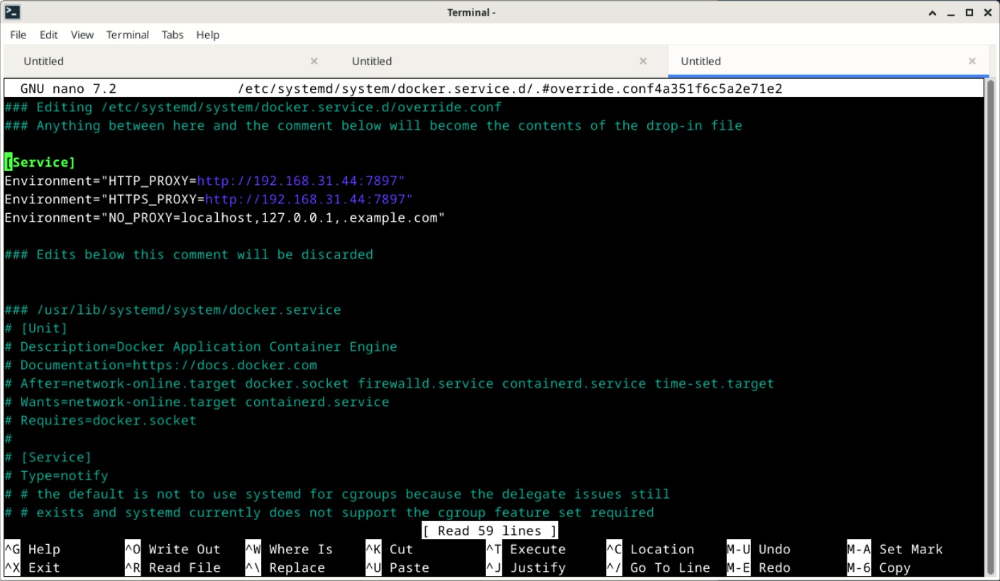

# Installing riscv64 Docker

The package for the riscv64 Docker installation is already available in the repository under the name `docker.io`. You can install it directly using:

```bash
sudo apt install docker.io
``` 

# Testing Docker

To test the installation, run the following command:

```bash
sudo docker pull riscv64/debian:unstable
```

# Tips

## Running Docker Without Root Privileges

If you want to run Docker without root permissions (without using sudo), you may encounter the following error:

```bash
debian@lpi4a:~$ docker pull riscv64/debian:unstable
Got permission denied while trying to connect to the Docker daemon socket at unix:///var/run/docker.sock: Post "http://%2Fvar%2Frun%2Fdocker.sock/v1.24/images/create?fromImage=riscv64%2Fdebian&tag=unstable": dial unix /var/run/docker.sock: connect: permission denied
```

To resolve this, you need to add your user to the `docker` group by running the following command:

```bash
sudo usermod -aG docker $USER # Replace $USER with the username that needs to run Docker without root permission
```

After executing this, log out and log back in. You can verify that you can run Docker without elevated privileges by checking your group ID:

```
$ id
uid=1000(debian) gid=1000(debian) groups=1000(debian),4(adm),7(lp),24(cdrom),25(floppy),27(sudo),29(audio),30(dip),44(video),46(plugdev),105(netdev),106(bluetooth),112(docker),996(input) # Look for the 'docker' group here
```

## Configuring a Proxy for Docker

To set up a proxy for Docker, you can use the `systemctl edit` command to make modifications to the `docker.service`. This method is more flexible compared to directly editing the `docker.service` file, preventing configuration file overwrites during system updates.

Run the following command in the terminal to open the editor:

```bash
sudo systemctl edit docker
```

This will bring up an editing interface similar to the one shown below.


In the blank area, add the following configuration (make sure to replace the proxy addresses with your actual ones):

```toml
[Service]
Environment="HTTP_PROXY=http://proxy.example.com:8080/"
Environment="HTTPS_PROXY=http://proxy.example.com:8080/"
Environment="NO_PROXY=localhost,127.0.0.1,.example.com"
```



Once you've made the changes, restart Docker to apply the new settings:

```bash
sudo systemctl restart docker
```